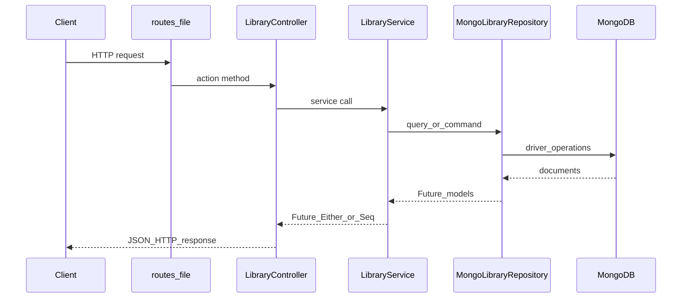

# Scala Play Library Management Service

REST API for managing **authors** and **books**, backed by **MongoDB**. The app is built with **Play Framework 2.9**, **Scala 2.13**, and **Java 11**.

---

## What this service does

| Endpoint | Method | Description |
|----------|--------|-------------|
| `/` | GET | JSON overview of available routes |
| `/api/authors` | POST | Create an author |
| `/api/books` | POST | Create a book (must reference an existing author) |
| `/api/authors/:authorId/books` | GET | List all books for an author |
| `/api/books/:id` | GET | Get one book by MongoDB `ObjectId` (hex string) |
| `/api/books` | GET | List all books |

---

## Prerequisites

- **Java 11** (the project is configured with `--release` / `-release 11` in `build.sbt`).
- **sbt** (1.x; see `project/build.properties` for the pinned version).
- **MongoDB** reachable at the URI you configure (default: `mongodb://localhost:27017`).

---

## Quick start

1. Start MongoDB locally (for example on port `27017`).

2. Use Java 11 (macOS example):

   ```bash
   export JAVA_HOME=$(/usr/libexec/java_home -v 11)
   ```

3. From the project root, run the app:

   ```bash
   sbt run
   ```

4. The server listens on **http://localhost:9000** by default.

Optional environment overrides (see `conf/application.conf`):

- `MONGODB_URI` — connection string (default `mongodb://localhost:27017`).
- `MONGODB_DATABASE` — database name (default `library`).

---

## Project layout (service structure)

Play follows a conventional layout. Below is how this repository maps **HTTP → business logic → persistence**.

```text
scala-play-library/
├── app/                          # Application code (Scala)
│   ├── controllers/              # HTTP layer: routes, JSON, status codes
│   │   └── LibraryController.scala
│   ├── services/                 # Domain rules, validation, orchestration
│   │   └── LibraryService.scala
│   ├── repositories/             # MongoDB access only (no HTTP knowledge)
│   │   └── MongoLibraryRepository.scala
│   ├── models/                   # DTOs, JSON Reads/Writes, API payloads
│   │   └── LibraryModels.scala
│   ├── Module.scala              # Guice: binds MongoClient → provider
│   └── MongoClientProvider.scala # Singleton MongoClient + shutdown hook
├── conf/
│   ├── application.conf          # Play + Mongo settings, CSRF disabled for JSON API
│   ├── logback.xml               # Logging
│   └── routes                    # URL → controller method mapping
├── project/
│   ├── build.properties          # sbt version
│   └── plugins.sbt               # Play sbt plugin
├── public/                       # Static assets (optional for a pure API)
├── build.sbt                     # Scala version, Java 11, dependencies
└── README.md
```

### Layer-by-layer responsibilities

1. **`conf/routes`**  
   Declares URLs and HTTP verbs and forwards them to `LibraryController` methods. This is the **public API surface** of the web server.

2. **`app/controllers/LibraryController.scala`** (HTTP / presentation)  
   - Parses request bodies as JSON (`CreateAuthorRequest`, `CreateBookRequest`) using Play’s body parsers.  
   - Calls `LibraryService` and maps results to HTTP: `200 OK`, `201 Created`, `400 Bad Request`, `404 Not Found`.  
   - Serializes responses with Play JSON (`Json.toJson`).  
   - Receives an implicit **`ExecutionContext`** so `Future` transformations run on an appropriate thread pool.

3. **`app/services/LibraryService.scala`** (application / domain)  
   - Encodes **business rules**: non-blank names/titles, valid MongoDB `ObjectId` hex strings, “author must exist before adding a book,” “author must exist to list their books.”  
   - Returns **`Future[Either[LibraryServiceError, T]]`** (or `Future[Seq[Book]]` for the list-all case) so the controller can translate domain outcomes to HTTP without mixing MongoDB details into controllers.  
   - Defines **`LibraryServiceError`** variants (`InvalidObjectId`, `AuthorNotFound`, `BookNotFound`) used for consistent error handling.

4. **`app/repositories/MongoLibraryRepository.scala`** (infrastructure / persistence)  
   - Owns all **MongoDB** interaction: `authors` and `books` collections.  
   - Uses **`MongoClient`** (injected) and **`Configuration`** for `mongodb.database`.  
   - Maps BSON `Document` rows to **`Author`** / **`Book`** case classes.  
   - Exposes small, focused methods: insert, find by id, find by author, find all.  
   - Does **not** decide HTTP status codes; it only returns data or empty options.

5. **`app/models/LibraryModels.scala`**  
   - **`Author`**, **`Book`**: entities returned in JSON responses.  
   - **`CreateAuthorRequest`**, **`CreateBookRequest`**: incoming JSON (with `Reads`).  
   - **`ErrorResponse`**: simple `{ "error": "..." }` shape for failures.

6. **`app/Module.scala` + `MongoClientProvider.scala`** (composition / lifecycle)  
   - Guice **`Module`** binds `MongoClient` to **`MongoClientProvider`**, which builds the client from `mongodb.uri` and registers an **`ApplicationLifecycle`** stop hook to **`close()`** the client when the app shuts down.

---

## Request flow (high level)



---

## MongoDB data model

Database name: **`library`** (configurable via `mongodb.database` / `MONGODB_DATABASE`).

| Collection | Fields | Notes |
|--------------|--------|--------|
| **`authors`** | `_id` (`ObjectId`), `name` (`String`) | `_id` is generated on insert. |
| **`books`** | `_id` (`ObjectId`), `title` (`String`), `authorId` (`ObjectId`) | `authorId` references `authors._id`. |

APIs expose ids as **24-character hex strings** (standard `ObjectId` string form).

---

## API reference (JSON)

### `POST /api/authors`

**Body:**

```json
{ "name": "Jane Austen" }
```

**Success:** `201 Created` — created author, for example:

```json
{ "id": "6610...", "name": "Jane Austen" }
```

**Client error:** `400 Bad Request` if `name` is missing, invalid JSON, or blank after trim — body shape: `{ "error": "..." }`.

---

### `POST /api/books`

**Body:**

```json
{ "title": "Pride and Prejudice", "authorId": "<24-hex author _id>" }
```

**Success:** `201 Created` — created book with `id`, `title`, `authorId`.

**Errors:**

- `400 Bad Request` — invalid `authorId` format, blank `title`, or malformed JSON.  
- `404 Not Found` — `authorId` is syntactically valid but no author exists with that id (`{ "error": "author not found: ..." }`).

---

### `GET /api/authors/:authorId/books`

Lists books whose `authorId` matches the given author.

**Errors:**

- `400 Bad Request` — `authorId` is not a valid `ObjectId` hex string.  
- `404 Not Found` — author id valid but author does not exist.

**Success:** `200 OK` — JSON array of books (possibly empty if the author has no books yet).

---

### `GET /api/books/:id`

**Success:** `200 OK` — single book object.

**Errors:**

- `400 Bad Request` — invalid id format.  
- `404 Not Found` — unknown book id.

---

### `GET /api/books`

**Success:** `200 OK` — JSON array of all books in the `books` collection.

---

## Example `curl` session

Replace `<AUTHOR_ID>` and `<BOOK_ID>` with real hex ids returned by the API.

```bash
# Create author
curl -s -X POST http://localhost:9000/api/authors \
  -H "Content-Type: application/json" \
  -d '{"name":"Jane Austen"}'

# Create book (use id from previous response)
curl -s -X POST http://localhost:9000/api/books \
  -H "Content-Type: application/json" \
  -d '{"title":"Pride and Prejudice","authorId":"<AUTHOR_ID>"}'

# Books by author
curl -s "http://localhost:9000/api/authors/<AUTHOR_ID>/books"

# One book
curl -s "http://localhost:9000/api/books/<BOOK_ID>"

# All books
curl -s "http://localhost:9000/api/books"
```

---

## Configuration notes

- **`play.http.secret.key`** in `conf/application.conf` is a development placeholder. **Change it** before any real deployment.  
- **CSRF filter** is disabled for this JSON API (`play.filters.disabled`). For browser-based forms you would re-enable CSRF and issue tokens instead.  
- **`play.modules.enabled += "Module"`** registers the Guice `Module` class in `app/Module.scala` for `MongoClient` binding.

---

## Tech stack summary

| Piece | Choice |
|-------|--------|
| Runtime | Java **11** |
| Language | Scala **2.13.15** |
| Web framework | **Play 2.9.5** |
| DI | **Guice** (`guice` dependency + `Module`) |
| Database | **MongoDB** via **mongo-scala-driver** **5.2.1** |
| JSON | **Play JSON** (`play.api.libs.json`) |

---

## Further work (ideas)

- Pagination for `GET /api/books`.  
- Authentication / authorization.  
- Automated tests (repository or controller) with a test Mongo instance.  
- Unique indexes (for example on author name) if your domain requires them.
